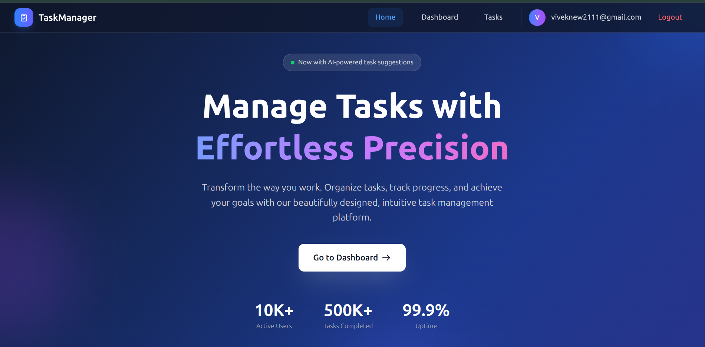
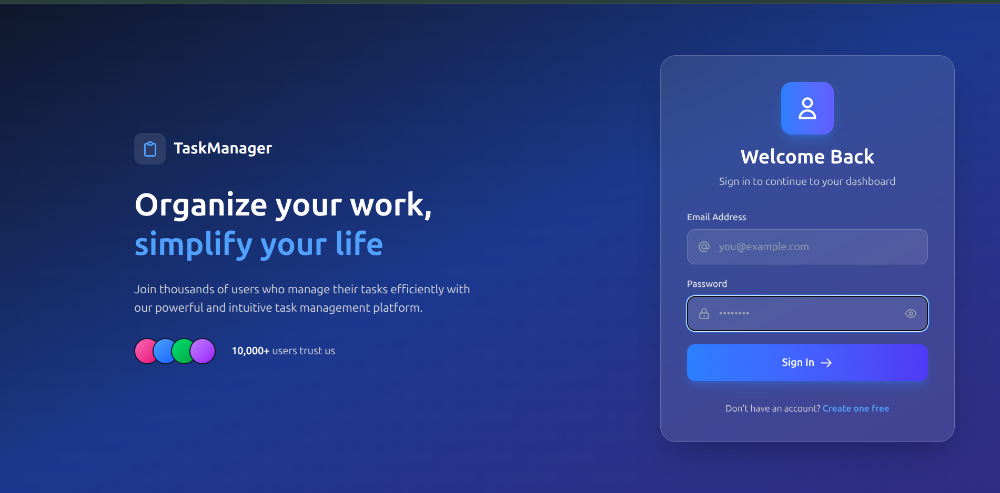
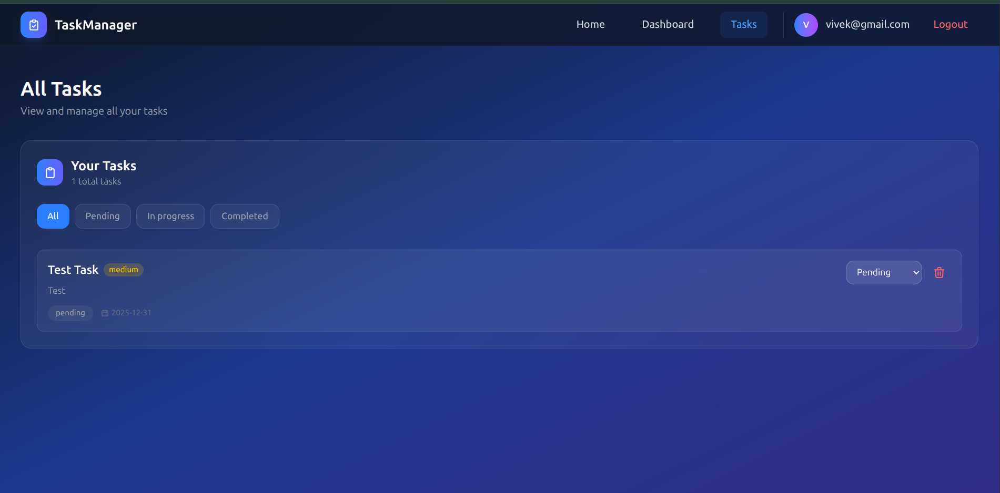
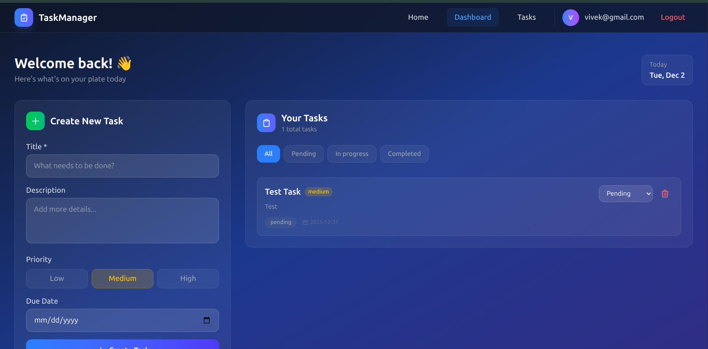
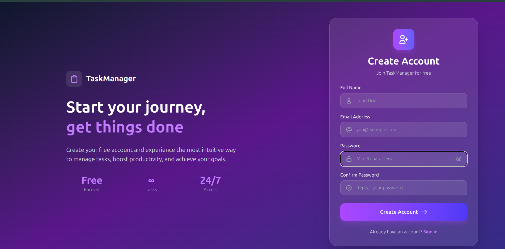

# TaskManager Client

A modern React 18 + Vite frontend for the TaskManager API with JWT authentication, role-based access, and a sleek dark theme.



## Tech Stack

- **React 18** - UI Library
- **Vite** - Build tool & dev server
- **React Router DOM v6** - Client-side routing
- **Tailwind CSS** - Utility-first CSS framework
- **Axios** - HTTP client with interceptors

## Features

### ✅ Authentication & Authorization
- JWT-based authentication with secure token storage
- Role-based access (Admin, Collector, Supervisor)
- Protected routes for authenticated users
- Public route protection (redirects logged-in users away from login/register)



### ✅ Task Management
- Full CRUD operations (Create, Read, Update, Delete)
- Task filtering and search
- Status management (Pending, In Progress, Completed)
- Priority levels (Low, Medium, High)
- Due date tracking



### ✅ Modern UI/UX
- Consistent dark theme across all pages
- Responsive design for all screen sizes
- Elegant navigation bar with active link highlighting
- Clean footer design
- Smooth transitions and hover effects



### ✅ Route Protection
- **ProtectedRoute**: Redirects unauthenticated users to login
- **PublicRoute**: Redirects authenticated users to home (prevents accessing login/register when logged in)

## Getting Started

### Prerequisites

- Node.js 18+
- pnpm (or npm/yarn)

### Installation

```bash
# Navigate to the Client Directory
cd DAY03_19/TaskManagerClient

# Install dependencies
pnpm install

# Start development server
pnpm dev
```

Open [http://localhost:5173](http://localhost:5173) in your browser.

### Environment Variables

Create a `.env` file:

```env
VITE_API_URL=http://localhost:8000
```

## Project Structure

```
TaskManagerClient/
├── eslint.config.js
├── index.html
├── package.json
├── pnpm-lock.yaml
├── vite.config.js
└── src/
    ├── api/
    │   └── axios.js          # Axios instance with interceptors
    ├── assets/
    │   └── react.svg
    ├── components/
    │   ├── Footer.jsx        # Elegant dark footer
    │   ├── Hero.jsx          # Hero section
    │   ├── NavBar.jsx        # Navigation with dark theme
    │   ├── TaskForm.jsx      # Create/edit task form
    │   ├── TaskList.jsx      # Task list with dark theme
    │   ├── ProtectedRoute.jsx # Auth guard for protected pages
    │   └── PublicRoute.jsx   # Redirect guard for auth pages
    ├── Layouts/
    │   ├── MainLayout.jsx    # Layout with NavBar and Footer
    │   └── NoLayout.jsx      # Clean layout for auth pages
    ├── pages/
    │   ├── Dashboard.jsx     # User dashboard
    │   ├── Error.jsx         # Error page
    │   ├── Home.jsx          # Landing page
    │   ├── Login.jsx         # Login with dark theme
    │   ├── Register.jsx      # Registration with role selection
    │   └── Tasks.jsx         # Task management
    ├── App.css               # Global styles
    ├── App.jsx               # Routes with protection wrappers
    ├── index.css             # Tailwind imports
    └── main.jsx              # Entry point
```

## API Integration

The client connects to the FastAPI backend via Vite proxy at `/api/v1`.

### Endpoints Used

| Method | Endpoint | Description | Auth Required |
|--------|----------|-------------|---------------|
| POST | `/auth/login` | User login | No |
| POST | `/auth/register` | User registration | No |
| GET | `/tasks/` | List all tasks | Yes |
| POST | `/tasks/` | Create new task | Yes |
| PUT | `/tasks/{id}` | Update task | Yes |
| DELETE | `/tasks/{id}` | Delete task | Yes |

## Routes

| Path | Component | Protection | Description |
|------|-----------|------------|-------------|
| `/` | Home | Public | Landing page with hero section |
| `/login` | Login | PublicRoute | Login form (redirects if logged in) |
| `/register` | Register | PublicRoute | Registration with role selection |
| `/dashboard` | Dashboard | ProtectedRoute | User dashboard |
| `/tasks` | Tasks | ProtectedRoute | Task management |
| `*` | Error | Public | 404 error page |

## Components

### Core Components
- **NavBar**: Dark themed navigation with active link highlighting, Home link, and conditional auth buttons
- **Footer**: Elegant dark footer with copyright
- **Hero**: Landing page hero section with CTA

### Task Components
- **TaskForm**: Form for creating/editing tasks with validation
- **TaskList**: Displays tasks in a dark themed list with actions

### Route Guards
- **ProtectedRoute**: Wraps routes that require authentication. Redirects to `/login` if no token.
- **PublicRoute**: Wraps auth routes (login/register) to redirect logged-in users to `/`.

## Styling

Uses Tailwind CSS with a consistent dark theme:

```
## Development

```bash
# Run dev server
pnpm dev

# Build for production
pnpm build

# Preview production build
pnpm preview

# Lint
pnpm lint
```

## Screenshots

| Page | Preview |
|------|--------|
| Home |  |
| Login |  |
| Register |  |
| Dashboard |  |
| Tasks |  |

## Recent Updates

### v2.0.0
- ✅ Implemented JWT authentication with role claims
- ✅ Added role-based access (Admin, Collector, Supervisor)
- ✅ Created ProtectedRoute and PublicRoute components
- ✅ Consistent dark theme across all pages
- ✅ Fixed API proxy double path issue
- ✅ Added Home link to navbar
- ✅ Elegant footer redesign
- ✅ Fixed navbar duplication in Dashboard
- ✅ Made user_id optional in task creation (fetched from JWT)

